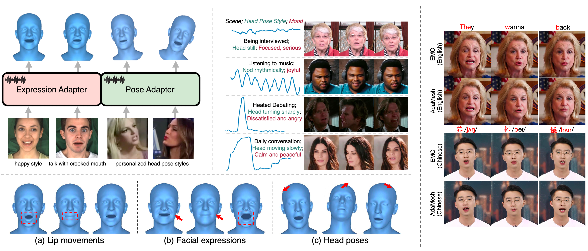

# AdaMesh

<a href='https://arxiv.org/abs/2310.07236/'></a>
<a href='https://thuhcsi.github.io/AdaMesh/'></a>

AdaMesh: Personalized Facial Expressions and Head Poses for Adaptive Speech-Driven 3D Facial Animation



---


## Setup

- pip install -r requirements.txt

- Our method relies on 3D face reconstruction. If you want to extract facial coefficients or visualize them, please refer to the following repository to install the environment: 
[Spectre for 3D face reconstruction](https://github.com/filby89/spectre), [Voca for visualization](https://github.com/TimoBolkart/voca)

## Training

Please note:
- Our model is trained in the space of face coefficients. Therefore, you need to prepare your data in the form of coefficients. You may refer to [Spectre]((https://github.com/filby89/spectre)) or [DiffPoseTalk](https://github.com/DiffPoseTalk/DiffPoseTalk/tree/main) for reference.

```shell
bash train.sh
```


## Inference

```shell
bash test.sh
```


---

## Citation

```bibtex
@ARTICLE{AdaMesh2025,
  author={Chen, Liyang and Bao, Weihong and Lei, Shun and Tang, Boshi and Wu, Zhiyong and Kang, Shiyin and Huang, Haozhi and Meng, Helen},
  journal={IEEE Transactions on Multimedia}, 
  title={AdaMesh: Personalized Facial Expressions and Head Poses for Adaptive Speech-Driven 3D Facial Animation}, 
  year={2025},
  volume={27},
  pages={3598-3609},
  doi={10.1109/TMM.2025.3535287}
}

```
